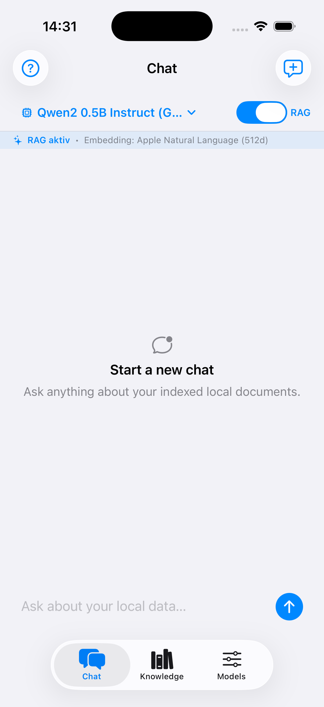
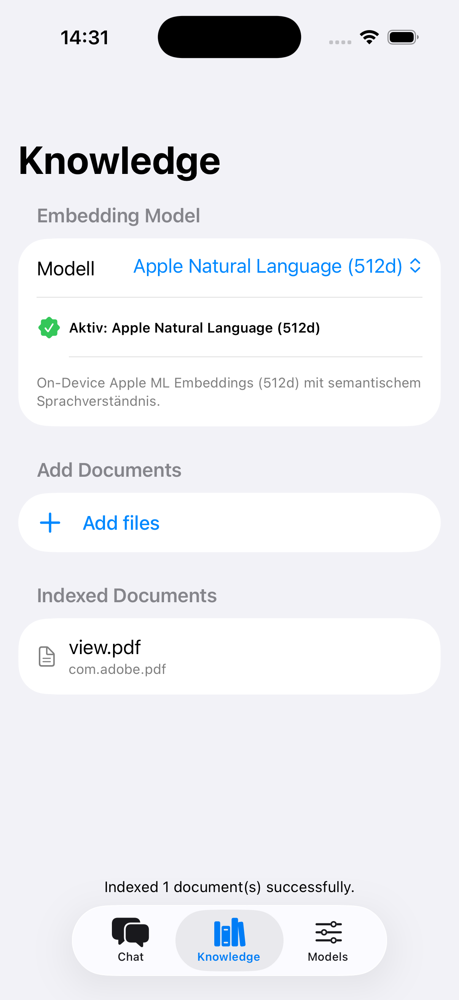
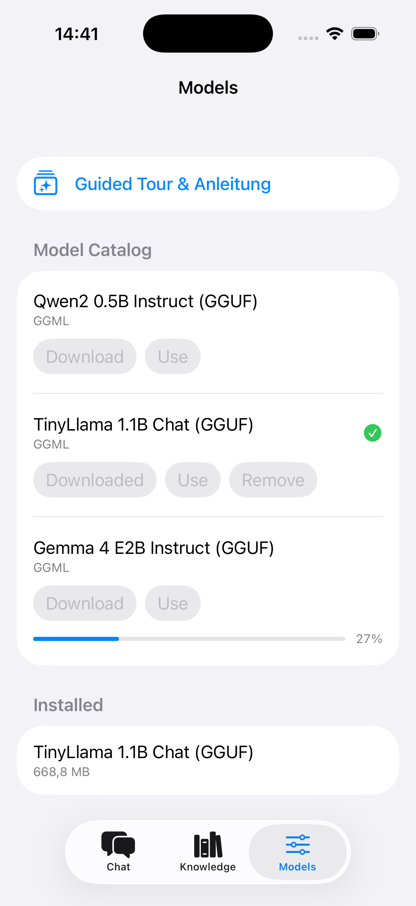

# iOS-RAG

A native SwiftUI iOS application that runs a complete, 100% private, on-device **Retrieval-Augmented Generation (RAG)** pipeline and local LLM inference directly on your iPhone.

---

## Screenshots

<p align="center">
  
  &nbsp;&nbsp;&nbsp;&nbsp;
  
    &nbsp;&nbsp;&nbsp;&nbsp;
  
</p>

---

## Features

- **Real On-Device Local LLM Inference**:
  - Powered by `LLM.swift` / `llama.cpp` with Apple Metal hardware acceleration.
  - Supports popular GGUF quantizations (**Qwen2 0.5B Instruct**, **TinyLlama 1.1B Chat**, **Gemma 4 E2B Instruct**).
  - Quick model switching directly from the Chat screen menu.

- **Private Document Ingestion & Knowledge Base**:
  - Support for **PDF documents** (via `PDFKit` with Vision OCR fallback for scanned pages).
  - Support for **Plain Text & Markdown** (`.txt`, `.md`, `.json`, `.csv`, source files) with automatic multi-encoding fallbacks.
  - Support for **Images** via Apple `Vision` on-device OCR text recognition (`VNRecognizeTextRequest`).

- **Selectable On-Device Embedding Models**:
  - **Apple Natural Language (512d)** *(Default, Recommended)*: Built directly into iOS — zero download required, instant semantic vectors and language understanding.
  - **Fast Token Hash (384d)**: Fast, lightweight deterministic token hashing.
  - **High-Dim Token Hash (768d)**: High-dimensional hashing for larger text corpora.

- **SQLite-Backed Vector Store**:
  - Fast cosine similarity search across local document chunks.
  - Persistent storage in `Application Support/rag.sqlite3`.

- **Guided Tour & Onboarding**:
  - Interactive onboarding tour guiding new users through model downloads, document indexing, and chat.
  - Proactive guidance indicators and model selection menus.

---

## Project Structure

```text
iOS-RAG/
├── iOS-RAG.xcodeproj/          # Xcode project configuration & SPM dependencies
├── iOS-RAG/
│   ├── Models/                 # Domain models (ChatMessage, ChatSession, IndexedDocument, etc.)
│   ├── Services/               # Core services:
│   │   ├── DocumentIngestionService.swift  # PDF, OCR, and text extraction & chunking
│   │   ├── EmbeddingService.swift          # Apple NaturalLanguage & token hash embeddings
│   │   ├── ModelDownloadService.swift      # In-app GGUF model downloader & catalog
│   │   ├── ModelRunner.swift               # GGUFLocalRunner (llama.cpp integration)
│   │   ├── RAGService.swift                # Vector search + LLM response coordination
│   │   ├── SessionStore.swift              # Chat history persistence
│   │   └── VectorStore.swift               # SQLite vector database
│   ├── ViewModels/             # ChatViewModel, IndexViewModel, SettingsViewModel, AppContainer
│   └── Views/                  # SwiftUI views:
│       ├── ChatView.swift                  # Chat interface with model & RAG controls
│       ├── GuidedTourView.swift            # Interactive onboarding modal
│       ├── IndexManagerView.swift          # Knowledge & document management
│       └── SettingsView.swift              # Model catalog & downloads
└── docs/screenshots/           # App screenshots for documentation
```

---

## How to Run

### Prerequisites
- macOS 14+ with Xcode 15+ / Xcode 16+
- iOS 17.0+ Simulator or Physical Device (iPhone / iPad with Apple Silicon recommended for local inference)

### Steps
1. Open `iOS-RAG.xcodeproj` in Xcode:
   ```bash
   open iOS-RAG.xcodeproj
   ```
2. Select an iOS Simulator or connected iOS device (iOS 17+).
3. Press **⌘ + R** (Run) to build and launch the app.
4. **Download a Model**: Navigate to the **Models** tab and download your preferred model (e.g. *Qwen2 0.5B Instruct* or *Gemma 4 E2B Instruct*).
5. **Index Documents**: In the **Knowledge** tab, tap **+ Add files** to import PDFs, notes, or images.
6. **Chat**: In the **Chat** tab, ask questions about your documents with the **RAG** toggle enabled!

---

## Supported Model Catalog

| Model | Architecture | Size | Format / Template | Source |
| :--- | :--- | :--- | :--- | :--- |
| **Qwen2 0.5B Instruct** | Qwen2 | ~0.40 GB (398 MB) | GGUF (Q4_K_M) / ChatML | Hugging Face (`Qwen`) |
| **TinyLlama 1.1B Chat** | LLaMA | ~0.67 GB (669 MB) | GGUF (Q4_K_M) / LLaMA | Hugging Face (`TheBloke`) |
| **Gemma 4 E2B Instruct** | Gemma 4 | ~3.43 GB | GGUF (Q4_K_M) / Gemma | Hugging Face (`unsloth`) |

---

## Privacy & Security

- **Zero Cloud Dependence**: All document parsing, embeddings, vector database lookups, and LLM inferences execute 100% offline and locally on your device.
- **Sandboxed File Access**: Document imports use secure, security-scoped bookmarks without leaving the device sandbox.

